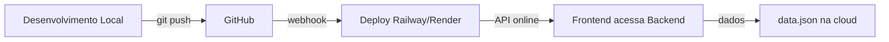

# 🎯 Guia Completo: Próximos Passos & Deploy Gratuito

## 📋 Índice
1. [O que fazer agora](#1--o-que-fazer-agora)
2. [Como funciona o banco de dados](#2--como-funciona-o-banco-de-dados)
3. [Tornar funcional em 5 minutos](#3--tornar-funcional-em-5-minutos)
4. [Deploy gratuito](#4--deploy-gratuito-3-opções)
5. [Troubleshooting](#5--troubleshooting)

---

## 1️⃣ O Que Fazer Agora

### Passo 1: Instalar Go (se não tiver)
```bash
# Windows
choco install golang  # ou baixe em https://golang.org/dl

# macOS
brew install go

# Linux
sudo apt-get install golang-go
```

Verificar instalação:
```bash
go version
```

### Passo 2: Entrar na pasta do backend
```bash
cd "sua-pasta\Barbearia\go-barbershop"
```

### Passo 3: Baixar dependências
```bash
go mod download
go mod tidy
```

### Passo 4: Executar servidor
```bash
go run cmd/server/main.go
```

Você verá:
```
🚀 Servidor iniciado em http://localhost:8080
```

### Passo 5: Testar (abra outra aba do terminal)
```bash
# Windows
test-api.bat

# Linux/Mac
chmod +x test-api.sh
./test-api.sh
```

✅ **Pronto! Servidor funcionando!**

---

## 2️⃣ Como Funciona o Banco de Dados

### 📊 Sistema Atual: JSON File-Based

O projeto **não usa PostgreSQL/MySQL**, usa **JSON em arquivo**. Aqui's como funciona:

#### Estrutura
```
Pasta: go-barbershop/data/
Arquivo: data.json
```

#### Exemplo de data.json
```json
{
  "barbeiros": {
    "1": {
      "id": "1",
      "nome": "Carlos Silva",
      "telefone": "(11) 98765-4321",
      "email": "carlos@barberpro.com",
      "especialidades": ["Corte", "Barba"],
      "foto": ""
    }
  },
  "clientes": {
    "1": {
      "id": "1",
      "nome": "Pedro Oliveira",
      "telefone": "(11) 99876-5432",
      "email": "pedro@email.com"
    }
  },
  "agendamentos": {
    "1": {
      "id": "1",
      "clienteId": "1",
      "barbeiroId": "1",
      "data": "2026-05-20",
      "hora": "14:00",
      "servico": "Corte",
      "status": "confirmado",
      "notificacaoEnviada": true
    }
  }
}
```

### ⚙️ Fluxo de Funcionamento

```
Requisição HTTP
    ↓
Validação em handler.go
    ↓
Lógica em services.go
    ↓
CRUD em storage.go
    ↓
Lê/Escreve em data.json
    ↓
Retorna resposta JSON
```

### 🔒 Thread-Safety

```go
// Em storage.go - usando RWMutex
type Storage struct {
    mu sync.RWMutex  // ← Garante segurança
    // ...
}
```

### 📈 Limitações (para Produção)

| Aspecto | JSON | PostgreSQL |
|---------|------|-----------|
| Múltiplas instâncias | ❌ Locking | ✅ Nativa |
| Backups | Manual | Automático |
| Queries complexas | Difícil | Fácil |
| Performance | OK (<10k) | Excelente |
| Escalabilidade | Limitada | Ilimitada |

### ✅ Quando usar JSON
- ✅ Desenvolvimento
- ✅ Prototipagem
- ✅ Pequenos projetos (<1000 usuários)
- ✅ Projetos educacionais

### 🔄 Upgrade para PostgreSQL (Opcional)

Se precisar escalar, siga [DEPLOYMENT.md](DEPLOYMENT.md#upgrade-para-postgresql)

---

## 3️⃣ Tornar Funcional em 5 Minutos

### ✅ Checklist Rápido

```bash
# 1. Entrar na pasta (30s)
cd go-barbershop

# 2. Baixar dependências (2min)
go mod download

# 3. Executar (10s)
go run cmd/server/main.go

# 4. Testar (30s)
# Em outro terminal:
curl http://localhost:8080/health
```

**Total: ~3 minutos** ✨

### 📝 Exemplo de Uso - Criar Agendamento

#### 1. Criar um Cliente
```bash
curl -X POST http://localhost:8080/api/clientes \
  -H "Content-Type: application/json" \
  -d '{
    "nome": "João Silva",
    "telefone": "(11) 98765-1234",
    "email": "joao@email.com"
  }'
```

Response:
```json
{
  "success": true,
  "message": "Cliente criado com sucesso",
  "data": {
    "id": "abc123",
    "nome": "João Silva",
    "telefone": "(11) 98765-1234",
    "email": "joao@email.com"
  }
}
```

#### 2. Agendar
```bash
curl -X POST http://localhost:8080/api/agendamentos \
  -H "Content-Type: application/json" \
  -d '{
    "clienteId": "abc123",
    "barbeiroId": "1",
    "data": "2026-05-25",
    "hora": "14:00",
    "servico": "Corte"
  }'
```

#### 3. Enviar WhatsApp
```bash
curl -X POST http://localhost:8080/api/agendamentos/123/notificacao
```

Retorna URL do WhatsApp pronta para usar! 📱

---

## 4️⃣ Deploy Gratuito: 3 Opções

### 🏆 MELHOR OPÇÃO: Railway.app (Recomendado)

**Por quê?**
- ✅ 5GB storage/mês grátis
- ✅ Suporta Go nativamente
- ✅ Deploy automático via Git
- ✅ Sem cartão de crédito (14 dias grátis)
- ✅ Interface intuitiva

#### Passos

**1. Criar conta**
```
https://railway.app → Sign Up
```

**2. Preparar projeto**
```bash
# Adicionar Procfile na raiz do projeto
echo "web: go run cmd/server/main.go" > Procfile
```

**3. Fazer push ao Git**
```bash
git init
git add .
git commit -m "Initial commit"
git remote add origin https://github.com/seu-usuario/barbershop
git push -u origin main
```

**4. Conectar no Railway**
- Abrir https://railway.app/new
- Selecionar "GitHub"
- Conectar seu repositório
- Railway faz deploy automático!

**5. Acessar**
```
https://seu-projeto-production.up.railway.app
```

**Custo:** $0 (14 dias) → $5/mês depois

---

### 🐳 OPÇÃO 2: Render.com (Também Grátis)

**Por quê?**
- ✅ Plano gratuito ilimitado
- ✅ Build automático
- ✅ 750 horas/mês grátis
- ✅ Sem timeout

#### Passos

**1. Criar conta**
```
https://render.com → Sign Up
```

**2. Criar Procfile**
```bash
echo "web: cd go-barbershop && go run cmd/server/main.go" > Procfile
```

**3. Fazer push ao GitHub**
```bash
git push origin main
```

**4. Novo serviço em Render**
- Dashboard → New+ → Web Service
- Conectar repositório GitHub
- Runtime: Go
- Build command: `go mod download && go build -o app ./cmd/server`
- Start command: `./app`
- Deploy!

**5. Acessar**
```
https://seu-projeto.onrender.com
```

**Custo:** $0 (sempre grátis!)

---

### ☁️ OPÇÃO 3: Google Cloud Run (Mais Rápido)

**Por quê?**
- ✅ 2 milhões de requisições/mês grátis
- ✅ Deploy instantâneo
- ✅ Integrado com Google Cloud
- ✅ Melhor performance

#### Passos

**1. Instalar gcloud CLI**
```bash
# https://cloud.google.com/sdk/docs/install
```

**2. Configurar projeto**
```bash
gcloud init
gcloud config set project seu-projeto-id
```

**3. Deploy direto**
```bash
cd go-barbershop
gcloud run deploy barbershop \
  --source . \
  --runtime go121 \
  --region us-central1 \
  --allow-unauthenticated
```

**4. Acessar**
```
https://barbershop-xxxxx.run.app
```

**Custo:** $0 (conta nova, 90 dias de crédito grátis)

---

## 📊 Comparação Deploy Gratuito

| Feature | Railway | Render | Google Cloud |
|---------|---------|--------|--------------|
| Custo | $5/mês | $0 | $0 (crédito) |
| Setup | 5 min | 10 min | 15 min |
| Performance | ⭐⭐⭐ | ⭐⭐⭐ | ⭐⭐⭐⭐ |
| Uptime SLA | 99.9% | 99.9% | 99.99% |
| Storage | 5GB | Ilimitado | 5GB |
| Fácil? | ✅ Sim | ✅ Sim | ❌ Médio |

**Recomendação:** Railway ou Render (mais fácil)

---

## 5️⃣ Tornar de Verdade Funcional: Frontend + Backend

### 🎯 Conectar React ao Backend

Na pasta `Barbershop scheduling system/`, editar `src/app/utils/config.ts`:

```typescript
// De:
// const API_BASE_URL = 'http://localhost:8080'

// Para:
const API_BASE_URL = process.env.VITE_API_URL || 'http://localhost:8080'

// Em produção, usar:
// https://seu-backend.railway.app
```

### 🚀 Deploy Completo

**Opção 1: Dois serviços**
- Backend: Railway/Render
- Frontend: Vercel (grátis para React)

**Opção 2: Tudo em um**
- Backend no Railway
- Frontend estaticamente servido pelo backend

```bash
# Compilar frontend
cd "Barbershop scheduling system"
npm run build

# Copiar arquivos para backend
cp -r dist/* ../go-barbershop/public/

# Adicionar ao backend (no main.go)
router.PathPrefix("/").Handler(http.FileServer(http.Dir("public")))
```

---

## 🔄 Workflow Recomendado



---

## 🆘 Troubleshooting

### Erro: "Port 8080 already in use"
```bash
# Windows
netstat -ano | findstr :8080
taskkill /PID <PID> /F

# Linux/Mac
lsof -i :8080
kill -9 <PID>
```

### Erro: "Cannot find module"
```bash
go clean -modcache
go mod download
```

### CORS error no frontend
```bash
# Verificar se backend está retornando headers CORS
curl -H "Origin: http://localhost:3000" \
     -v http://localhost:8080/api/barbeiros
```

### Dados não persistem
```bash
# Verificar permissões da pasta data/
ls -la data/
chmod 755 data/
```

---

## ✅ Checklist Final

- [ ] Go instalado (`go version`)
- [ ] Dependências baixadas (`go mod download`)
- [ ] Servidor rodando (`go run cmd/server/main.go`)
- [ ] Health check ok (`curl http://localhost:8080/health`)
- [ ] Dados salvando (`curl test-api.sh ou .bat`)
- [ ] GitHub com código
- [ ] Deploy escolhido (Railway/Render/GCP)
- [ ] Backend online
- [ ] Frontend conectado ao backend online
- [ ] Funcionando 100%! 🎉

---

## 📚 Recursos Úteis

- [Go Getting Started](https://golang.org/doc/tutorial/getting-started)
- [Railway Docs](https://docs.railway.app)
- [Render Docs](https://render.com/docs)
- [Google Cloud Run](https://cloud.google.com/run/docs)
- [REST API Best Practices](https://restfulapi.net)

---

## 🎓 Resumo Rápido

### Banco de Dados
- Usa JSON em arquivo (`data.json`)
- Thread-safe com RWMutex
- Funciona bem para projetos pequenos
- Pode fazer upgrade para PostgreSQL depois

### Funcional em 5 Min
```bash
cd go-barbershop
go mod download
go run cmd/server/main.go
```

### Deploy Gratuito - Melhor Opção
**Railway.app** - $0 por 14 dias, depois $5/mês

### Próximo Passo
1. Executar localmente ✅
2. Fazer push ao GitHub
3. Deploy no Railway
4. Conectar frontend
5. Usar em produção!

---

**Dúvidas?** Volte neste documento ou pergunte! 🚀
